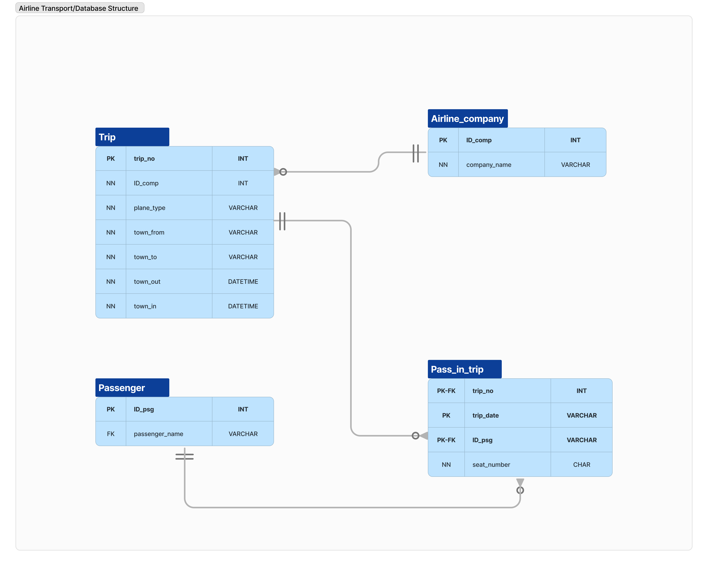

# Airline Transportation Data Analysis Project

## Description
This project is a comprehensive data analysis of an airline transportation database using SQL. It covers various stages from data cleaning and consistency checks to advanced analysis like flight route efficiency, frequent flyer identification, and passenger income segmentation using ABC analysis. This project is part of the **Databases with SQL and Python** course on the [Hyperskill platform](https://hyperskill.org).

## Database Schema
Below is a visual representation of the database structure used in this project.


## Database Explanation
We work with several tables, including:
- **Passenger** – Contains information about passengers like passenger ID (`ID_psg`) and passenger name (`passenger_name`).
- **Pass_in_trip** – This junction table links passengers to trips. It stores information about which passenger is on which trip and their assigned seat number.
- **Trip** – This table contains the essential details of each trip, including the flight schedule and the company operating the trip.
- **Airline_company** – Stores information about different airline companies that operate the trips. Each trip is linked to a specific airline.
### Relationships
  - An airline company operates a trip through the ID_comp foreign key.
  - Each passenger can be associated with multiple trips through the Pass_in_trip table.
  - The Pass_in_trip table connects the Trip and Passenger tables, recording which passengers are on each trip and their seat assignments.

## Project Structure
The project is organized into six stages:
- **Stage 1**: Date adjustment and synchronization.
- **Stage 2**: Identifying frequent flyers.
- **Stage 3**: Analyzing flight routes, flight durations, passengers, and income.
- **Stage 4**: Comparing Boeing and Airbus flight durations.
- **Stage 5**: Finding the top two routes with the longest durations for each airline company.
- **Stage 6**: Segmenting passengers using ABC testing based on their contribution to income.

## SQL Queries

### Overview
The following SQL files contain queries that analyze the database and provide insights based on various criteria:
- [stage_1_updating_passenger_trip_dates.sql](./stage_1_updating_passenger_trip_dates.sql)
- [stage_2_identifying_key_passengers.sql](./stage_2_identifying_key_passengers.sql)
- [stage_3_route_performance_analysis.sql](./stage_3_route_performance_analysis.sql)
- [stage_4_comparing_flight_duration.sql](./stage_4_comparing_flight_duration.sql)
- [stage_5_ranking_top_routes.sql](./stage_5_ranking_top_routes.sql)
- [stage_6_passenger_segmentation.sql](./stage_6_passenger_segmentation.sql)

### Example Queries
Below are a few key queries to illustrate the type of analysis performed:

#### Stage 1: Updating Passenger Trip Dates
```sql
ALTER TABLE Pass_in_trip
MODIFY trip_date DATE;

UPDATE Pass_in_trip
SET trip_date = CAST(trip_date AS DATE);

SELECT trip_date
FROM Pass_in_trip;
```
The query changes the data type of the trip_date column to DATE.
